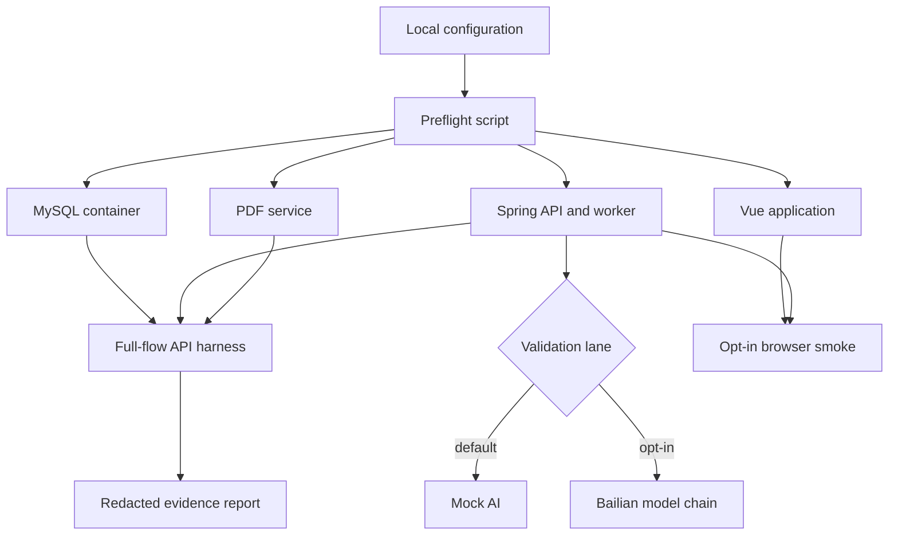

# feat: Local full-flow validation

## Goal Capsule

- **Objective:** Make the existing resume-builder workflow repeatable on one developer machine, with a deterministic mock-AI lane and an explicitly opt-in Bailian lane.
- **Authority:** Local validation only. No server, CI/CD, cloud deployment, production secret, or production release work is in scope.
- **Success signal:** A developer can start the required dependencies, execute a recorded end-to-end scenario, inspect a redacted report, and separately run a small live-AI quality gate without committing secrets or user data.

---

## Product Contract

### Summary

The plan adds a local validation harness around the current Vue, Spring Boot, MySQL, and PDF-service topology.
It preserves mock AI as the repeatable default and uses Bailian only through an explicit local opt-in.

### Problem Frame

The application has strong unit, build, and mocked-browser coverage, but the browser tests do not prove that the API worker, persistence layer, PDF renderer, download endpoint, and a real AI provider operate together.
The current setup also mixes several port/profile combinations and leaves developers to coordinate environment files and service tokens manually.

### Requirements

- R1. Provide one documented, repeatable local baseline using Docker MySQL, the Spring API, the PDF service, the Vue app, and mock AI.
- R2. Provide an explicit live-AI mode that reads the Bailian key only from ignored local configuration, keeps the existing configured model order, and never writes secrets or raw resume content to reports.
- R3. Validate the user-visible core flow: authentication, resume/version creation, career materials, JD, AI consent, job generation and confirmation, scoring, communication/application, interview assets, and PDF download.
- R4. Validate failure and recovery paths: withdrawn consent, AI failure/retry, PDF outage/retry, expired/invalid export access, and ownership isolation.
- R5. Produce a concise local evidence report in `.local-validation/`, containing only non-sensitive IDs, statuses, hashes, durations, and trace IDs.
- R6. Keep mock tests fast and deterministic; live provider tests and browser smoke tests must be opt-in so ordinary development does not consume model quota.

### Scope Boundaries

- Included: local scripts, local configuration examples, integration/smoke coverage, runbook documentation, and development-facing dependency diagnostics.
- Deferred to Follow-Up Work: CI integration, remote environments, TLS/reverse proxy configuration, centralized monitoring, backups, and release automation.
- Not included: changing the product workflow, automatic external sending, new AI providers, or persisting real-resume test fixtures.

---

## Planning Contract

### Key Technical Decisions

- KTD1. Use two local lanes. The MySQL plus mock-AI lane is the required repeatable baseline because it exercises the same Flyway/MySQL behavior as normal development; the Bailian lane reuses that topology and changes only provider configuration.
- KTD2. Keep `local-h2` as a fast developer aid, but do not call it the full-flow acceptance baseline because H2 compatibility does not prove MySQL behavior. Document its non-default ports and explicit provider override where useful.
- KTD3. Put orchestration in PowerShell scripts at the repository root. The scripts own the child-process/PID/log/readiness lifecycle for API, PDF, and Vue while Docker Compose owns MySQL; they also provide bounded, local-only PDF fault control and cleanup.
- KTD4. Treat the existing `BailianAiProviderLiveIT` suite as a provider-contract gate using anonymized fixed input. The live-gate script loads an ignored opt-in local secret file into the Maven child process; it adds structured per-task allowed-fact/forbidden-sentinel assertions and redacted summaries instead of printing full model payloads.
- KTD5. Keep the existing mocked Playwright suite as the default UI regression layer. Add a separately selected real-service smoke layer that consumes only seeded, synthetic data and requires an opt-in environment flag.
- KTD6. A local full-flow report is an acceptance artifact, not an application log. It records status, model attempted, duration, hash, trace ID, and redacted error class only. New reports, downloads, traces, and temporary files always live under ignored `.local-validation/`; the preflight verifies that Git ignores every output path before a run starts.

### High-Level Technical Design

### Sequencing

First make configuration and preflight deterministic, then establish API-level full-flow evidence, then add the live-provider gate and real-service browser smoke coverage.
Documentation is completed with the implementation so the commands, ports, and safety constraints cannot drift.

### Alternatives Considered

- H2-only acceptance was rejected as the primary lane because it avoids Docker but does not prove MySQL/Flyway compatibility.
- A fully mocked browser-only approach was rejected because it bypasses task workers, persistence, the PDF HTTP boundary, and download authorization.
- Always-on real AI tests were rejected because they consume quota, can be rate limited, and make normal development non-deterministic.

---

## Implementation Units

### U1. Standardize local validation configuration and preflight

- **Goal:** Make the required local topology and its configuration errors visible before a validation run begins.
- **Requirements:** R1, R2, R6.
- **Dependencies:** None.
- **Files:** `scripts/Start-LocalValidation.ps1`, `scripts/Stop-LocalValidation.ps1`, `scripts/Test-LocalPrerequisites.ps1`, `scripts/lib/LocalValidationHelpers.ps1`, `.env.example`, `server/.env.example`, `web/.env.example`, `pdf-service/.env.example`, `.gitignore`, `README.md`, `docs/08-部署与运维说明书.md`.
- **Approach:** Add PowerShell entry points that validate Java, Node, Docker, port availability, MySQL health, API/PDF reachability, CORS target, and matching PDF tokens; then start API/PDF/Vue as tracked child processes, wait for readiness, retain only redacted local logs, and stop them by recorded PID. Keep the automatically imported root `.env` mock-only. Load `AI_PROVIDER=bailian` and `BAILIAN_API_KEY` only into the live-gate child process from ignored `.env.live-ai`; reject live mode unless an explicit opt-in switch and `BAILIAN_LIVE_TEST=true` are both present. Make the baseline use ports `3306`, `8080`, `3001`, and `5173`; describe `local-h2` as an optional alternate lane with its own port overrides. Correct the PDF example so its token is a real configuration line, not comment text.
- **Patterns to follow:** Root `.env.example`, `docker-compose.yml`, `application.yml`, `application-local-h2.yml`, and the existing README startup sequence.
- **Test scenarios:** Missing live key leaves the mock lane usable and produces a clear preflight result; token mismatch fails before an export run; unavailable MySQL/PDF/API identifies the failed dependency without printing secret values; valid configuration starts all child services and reaches both existing health endpoints; service stop removes PIDs and does not leak process arguments or environment maps.
- **Verification:** A new developer can start and stop the mock baseline from the documented path and receives a clear pass/fail diagnostic for each dependency.

### U2. Build a synthetic-data API full-flow acceptance harness

- **Goal:** Exercise the actual API, worker, persistence, PDF renderer, and file download boundary with one isolated local test user.
- **Requirements:** R1, R3, R4, R5.
- **Dependencies:** U1.
- **Files:** `scripts/Test-LocalFullFlow.ps1`, `scripts/Invoke-LocalFault.ps1`, `scripts/lib/LocalValidationHelpers.ps1`, `server/src/main/resources/application-local-validation.yml`, `server/src/main/java/com/intelligentresume/ai/provider/MockAiProvider.java`, `docs/07-测试计划与验收说明书.md`, `docs/agent-tasks/evidence/README.md`.
- **Approach:** Use API requests with generated synthetic identity and career facts. Poll task states rather than fixed delays. Create and clean up only data owned by the run. Add a local-validation-only mock failure sequence for the synthetic run so a job task deterministically fails once and then succeeds on retry; do not expose this control in default or live modes. Use the lifecycle scripts to stop/restart the PDF service for the PDF retry drill. Supply a short test-only export TTL and deterministic cleanup trigger so expired download authorization is verifiable without a day-long wait. Assert job-draft provenance and confirmation decisions before creating a version, score the confirmed version, create an editable communication draft/application, create interview assets, request a PDF, download it through the authorized endpoint, verify the PDF signature and record a content hash. Write reports only under `.local-validation/` with restricted local permissions.
- **Patterns to follow:** `docs/agent-tasks/T11-MVP端到端验收.md`, `server/src/test/java/com/intelligentresume/**`, `pdf-service/test/*.test.js`, and the API response envelope used by `web/src/api/`.
- **Test scenarios:** A normal mock run completes the complete workflow; every pending generation item requires an explicit accept/edit/reject decision; a deterministic first job-generation failure persists FAILED and retry count before succeeding on retry; withdrawing consent returns the expected consent-required failure for every AI route in a maintained endpoint manifest while non-AI resume and export operations remain available; a stopped PDF service yields a failed task that succeeds after recovery and retry; invalid or expired file access is rejected; a second generated user cannot read the first user's IDs; generated report and stderr omit raw materials, tokens, cookies, authorization headers, and API keys.
- **Verification:** One script run emits a redacted machine-readable and human-readable result with an overall pass/fail status, task/export states, trace IDs, PDF hash, and cleanup outcome.

### U3. Harden the opt-in Bailian provider contract gate

- **Goal:** Validate real model responses against the AI schemas and fact-grounding guarantees without exposing private input or response bodies.
- **Requirements:** R2, R5, R6.
- **Dependencies:** U1.
- **Files:** `scripts/Invoke-LiveAiGate.ps1`, `server/src/test/java/com/intelligentresume/ai/provider/BailianAiProviderLiveIT.java`, `server/src/test/java/com/intelligentresume/ai/provider/BailianAiProviderTest.java`, `server/src/main/java/com/intelligentresume/ai/provider/BailianAiProvider.java`, `docs/07-测试计划与验收说明书.md`.
- **Approach:** Keep the current opt-in `BAILIAN_LIVE_TEST` guard and synthetic prompts. The gate script safely loads ignored `.env.live-ai` into its Maven process because `LiveIT` reads environment variables directly. Assert a per-task matrix of required fields/types, allowed supplied facts, and forbidden sentinel facts; for job generation also validate every nested provenance/pending field. Replace full-payload console output with redacted per-task summaries. Exercise first-model success and quota/rate-limit fallback in the unit test with a fake provider response; use only the first configured DeepSeek model in the initial live run, allowing the production fallback chain only when the provider returns quota/rate-limit signals.
- **Patterns to follow:** `BailianAiProviderTest`, `BailianAiProviderLiveIT`, `PromptBuilder`, and `JobGenerationSchemaValidator`.
- **Test scenarios:** Missing key fails before sending a request; valid synthetic task returns the expected shape and only supplied candidate facts; an intentionally JD-only sentinel skill/metric never appears as candidate history; a 429/quota response advances to the next configured model; a network failure, non-JSON payload, or unrelated 4xx fails without silently switching models; job generation rejects missing or malformed nested provenance; live test output, stderr, and report contain no raw prompt, resume text, bearer credential, or full model response.
- **Verification:** The opt-in provider gate reports pass/fail and redacted timing/model metadata for each task type, while the ordinary test suite remains quota-free.

### U4. Add an opt-in browser smoke layer against real local services

- **Goal:** Prove that the most important user interactions work in a browser when backed by the real local API and PDF service.
- **Requirements:** R3, R4, R6.
- **Dependencies:** U1, U2.
- **Files:** `web/playwright.config.ts`, `web/e2e/local-services.spec.ts`, `web/package.json`, `docs/07-测试计划与验收说明书.md`.
- **Approach:** Preserve `web/e2e/workflow.spec.ts` as the default mocked suite. Add a separate project or command enabled only by a local environment flag. It should target the lifecycle-managed Vue/API/PDF services, bootstrap a synthetic user through the API harness or dedicated setup endpoint, and prove the visible login/session, consent, generated-task confirmation, retry UI for an already failed task, and downloaded PDF flow. It must accept only canonical loopback HTTP origins on declared local ports after normalization, reject redirects/user-info/query-bearing URLs, and run with trace/video/screenshot capture off unless an explicit diagnostic-retention switch is present. Any retained diagnostic is sanitized and stays in `.local-validation/`.
- **Patterns to follow:** `web/playwright.config.ts`, `web/e2e/workflow.spec.ts`, current view routes, and the authentication refresh behavior in `web/src`.
- **Test scenarios:** Refresh retains a valid local session; a pending item prevents confirmation until every decision is chosen; a pre-created failed job/PDF task shows the retry UI; downloaded filename and PDF signature are correct; withdrawn consent routes the user to the consent state; the live-smoke command refuses to run without an explicit local-only flag and a normalized loopback-only origin; default artifacts contain no session or response data.
- **Verification:** Default Playwright remains fully mocked and fast; selected local-services smoke runs against the local topology and leaves a trace/screenshot only in ignored test artifacts.

### U5. Publish the local acceptance runbook and evidence policy

- **Goal:** Give developers one authoritative procedure for routine mock verification, optional live AI verification, failure drills, and safe evidence handling.
- **Requirements:** R1-R6.
- **Dependencies:** U1, U2, U3, U4.
- **Files:** `README.md`, `docs/07-测试计划与验收说明书.md`, `docs/08-部署与运维说明书.md`, `docs/agent-tasks/evidence/README.md`, `.gitignore`.
- **Approach:** Reconcile README port/profile guidance with the scripts. Document the two lanes, prerequisites, child-process lifecycle, expected health semantics, opt-in switches, synthetic fixture policy, endpoint manifest for consent-revocation coverage, and the exact evidence fields allowed in `.local-validation/`. Explicitly retain `docs/agent-tasks/evidence/` as historical documentation only: no new runtime artifact may be written there. Correct stale PDF-service wording so its health and rendering role are accurately described. Keep server and production material explicitly deferred.
- **Patterns to follow:** Root README, `docs/agent-tasks/evidence/T11-2026-07-12/report.md`, `.gitignore` conventions for generated files and test artifacts.
- **Test scenarios:** Documentation path starts and stops the mock lane without hidden configuration; live-AI instructions never include a real key and cannot activate from the ordinary `.env`; preflight proves `.local-validation/` is ignored before writes; evidence policy rejects raw request/response bodies; an intentionally stopped PDF service follows the documented recovery and retry procedure.
- **Verification:** A clean-machine developer can follow the runbook to complete the mock acceptance flow and can choose the live-AI gate without changing tracked files.

---

## System-Wide Impact

- The API's existing `/api/system/health` is an application liveness response, not a full dependency readiness contract. The local preflight must check MySQL and PDF explicitly rather than treating its current `SCAFFOLD` response as end-to-end proof.
- `application-local-h2.yml` deliberately sets mock AI, port `8081`, and PDF port `3010`. The runbook must prevent accidental claims that it ran live AI unless an explicit provider override was supplied.
- The PDF service and API share `PDF_SERVICE_TOKEN`; configuration validation must check equality without echoing either value.
- Live AI can create task retries and model fallback behavior that mock tests cannot reproduce. Its evidence must remain synthetic and redacted; the live gate's process environment must not leak into ordinary API runs.

## Risks and Dependencies

- **Bailian quota/rate limit:** Gate live tests behind explicit opt-in, run a small single-model sample first, and rely on existing fallback only for recognized quota/rate-limit responses.
- **Sensitive data leakage:** Use generated fixture data, disable verbose/transcript output and browser capture by default, redact report fields through shared helpers, and retain reports only in ignored `.local-validation/` output after `git check-ignore` validation.
- **Flaky asynchronous tests:** Poll persisted task states with time bounds and capture final trace/state in the report instead of adding fixed sleeps.
- **Local port/config drift:** Make scripts own the advertised baseline and fail early on conflicting ports, CORS origin, or PDF token configuration.
- **MySQL availability:** Docker Desktop and the root `docker-compose.yml` remain prerequisites for the acceptance baseline; H2 remains a documented fallback for fast UI development only.

## Sources and Research

- `README.md` and `.env.example` define the current four-process local topology and safe default provider.
- `docker-compose.yml` provisions only MySQL, which matches the local-only scope.
- `server/src/main/resources/application.yml` imports the ignored root `.env` and contains the Bailian model chain.
- `server/src/main/resources/application-local-h2.yml` documents the intentionally distinct H2 ports and mock provider.
- `server/src/test/java/com/intelligentresume/ai/provider/BailianAiProviderLiveIT.java` supplies the existing opt-in live provider coverage.
- `web/e2e/workflow.spec.ts` supplies current mock browser coverage for confirmation and retry paths.
- `docs/agent-tasks/T11-MVP端到端验收.md` and `docs/agent-tasks/evidence/T11-2026-07-12/report.md` supply the acceptance flow and prior evidence shape.

---

## Verification Contract

| Gate | Applies to | Done signal |
| --- | --- | --- |
| Server regression | U1-U3 | `server` Maven tests pass with live tests skipped unless explicitly enabled. |
| Provider unit contract | U3 | Fallback and non-fallback error classifications are covered without network access. |
| Opt-in live provider gate | U3 | Synthetic prompts pass schema/fact assertions and emit redacted summaries only. |
| PDF regression | U1-U2 | Static checks and template tests pass; the local harness validates a downloaded `%PDF` file. |
| Web regression | U4 | Existing mock Playwright suite and production build pass. |
| Local full-flow harness | U2 | One synthetic user completes the mock lane and report cleanup succeeds. |
| Local browser smoke | U4 | Explicitly selected local-services smoke covers consent, confirmation, retry, and PDF download. |

## Definition of Done

- All five implementation units are complete and their listed verification outcomes are observable.
- The repository keeps every API key, token, and every new generated report, download, screenshot, trace, and service output out of Git.
- The documented MySQL/mock lane can validate the complete workflow without model quota.
- The documented opt-in Bailian lane verifies each existing AI task type using only synthetic inputs and redacted outputs.
- A developer can reproduce both normal and failure/retry paths locally without server configuration.
