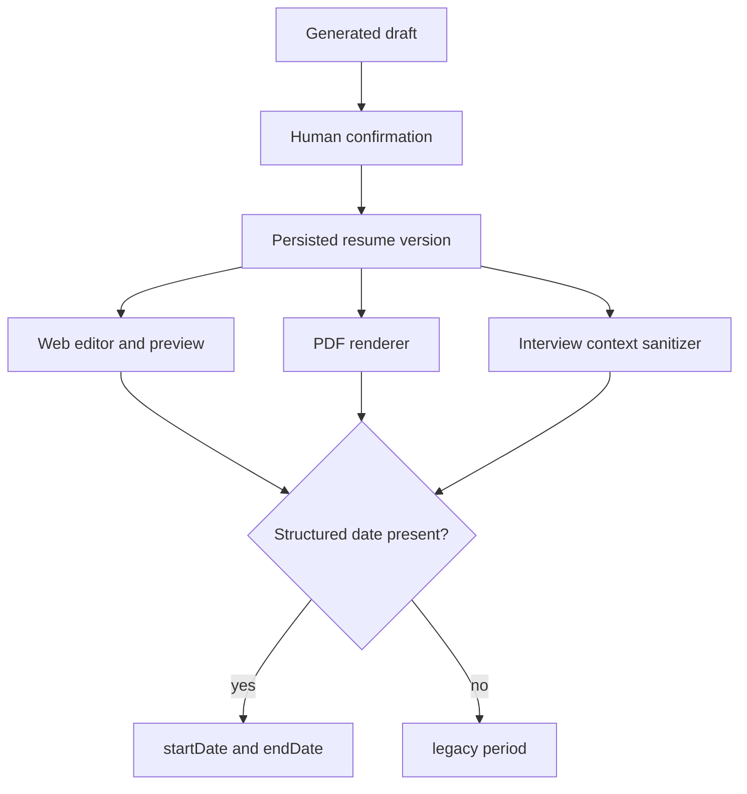
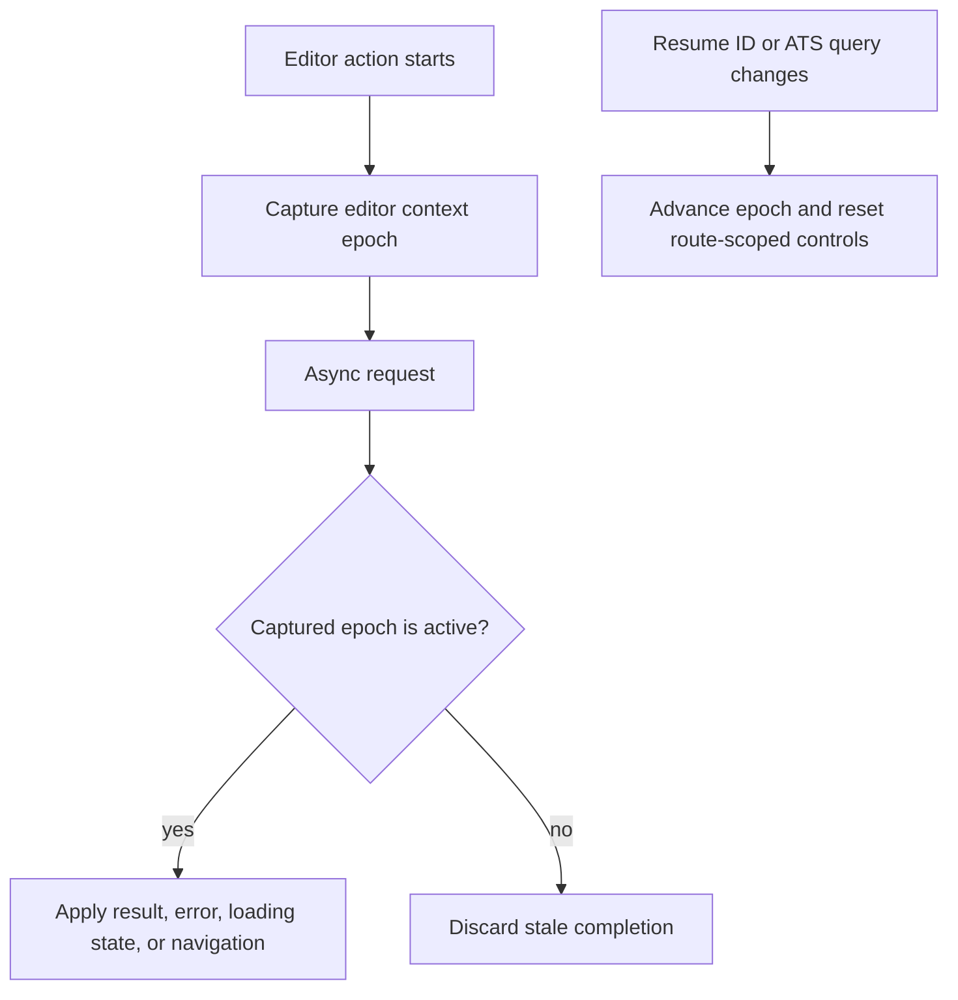

# Resume Flow Integrity - Plan

## Goal Capsule

- Objective: remove the verified loss of generated resume time information and prevent obsolete editor actions from mutating a newer ATS handoff context.
- Authority: `docs/reviews/2026-08-11-business-flow-audit.md`, the confirmed ATS product rules, and current source code.
- Scope: resume JSON time-range compatibility, generated-draft editing, Web/PDF/interview rendering parity, and route-scoped editor async state.
- Stop condition: a confirmed resume retains and displays its verified time information across every consumer, and obsolete editor requests cannot change the active context or navigate away from it.
- Execution profile: cross-service compatibility fix with browser, server, and PDF regression proof before optional real-service smoke verification.

---

## Product Contract

### Summary

The plan makes time ranges visible wherever a confirmed resume is consumed and makes the editor treat an ATS handoff query change as a new asynchronous context. It preserves historical resume JSON and the existing ATS source-version safety model.

### Problem Frame

AI generation currently emits `period`, while the visual preview, PDF renderer, and interview context mostly read only `startDate` and `endDate`. The confirmation boundary preserves this field, so a verified fact can disappear after confirmation. Separately, material actions use only the resume ID as their freshness check even though a same-resume ATS query change reloads the editor context.

### Requirements

**Resume time compatibility**

- R1. Work, education, and project entries support `startDate`, `endDate`, and legacy free-form `period` without deleting or parsing historical values.
- R2. Every resume consumer displays the structured range when either structural date is present; otherwise it displays `period`; it never displays both ranges together.
- R3. New generated drafts prefer `startDate` and `endDate` when the selected material supports exact bounds, and preserve a source-backed free-form `period` when it cannot be represented without invention.
- R4. The generation confirmation editor and visual resume editor expose the appropriate date fields for work, education, and projects while preserving legacy `period` content.

**Editor context integrity**

- R5. A change to a resume ID or ATS handoff query immediately invalidates all prior editor async UI completions.
- R6. Stale material loading, material insertion, save, and inline optimization completions do not change content, drafts, errors, controls, loading state, or navigation in the active context.
- R7. The existing dirty-navigation confirmation, historical ATS read-only mode, explicit editable-successor creation, and return-to-diagnosis entry retain their present behavior.

### Acceptance Examples

- AE1. A historical work item with only `period: "2021 - present"` is visible in the editor preview, generated PDF, and sanitized interview context.
- AE2. An entry containing both structured dates and an old `period` displays the structural range only.
- AE3. A material insertion started in one ATS handoff context completes after a confirmed same-resume handoff change; the newer context receives neither its content nor its error.
- AE4. A save started before a confirmed same-resume handoff change can finish server-side, but it cannot redirect away from or clear the newer editor context.

### Scope Boundaries

- Do not parse, backfill, or delete historical `period` values. Free-form ranges can encode facts such as a current role or a quarter that cannot be split reliably.
- Do not change ATS scoring, ownership checks, version restore semantics, or the dashboard priority policy.
- Do not introduce a new persistence table or change the immutable resume-version model.

#### Deferred to Follow-Up Work

- A separately approved data migration may later normalize only dates that have an unambiguous structured source. It is not part of this fix.
- Real-service smoke execution remains a release evidence task, not an implementation prerequisite for these local compatibility changes.

---

## Planning Contract

### Key Technical Decisions

- KTD-1. Treat `period` as a valid compatibility field, not a malformed value. Renderers use `startDate/endDate` first and fall back to `period` only when no structural date exists. This preserves evidence and prevents duplicate dates.
- KTD-2. Generation prompts prefer structural dates but may emit the original `period` when splitting it would infer data. Confirmation continues to preserve accepted fields without hidden transformation.
- KTD-3. Keep Web and PDF rendering helpers separate because they run in different applications, but enforce the same precedence through equivalent fixtures and tests.
- KTD-4. Model an editor context as an opaque epoch advanced synchronously before every resume-ID or handoff-query reload. Async callbacks must prove their captured epoch is still active before changing any editor-owned state.
- KTD-5. Reuse the existing sequence-based stale-response pattern in `web/src/views/CareerMaterialView.vue` and the editor's existing load sequence rather than adding request cancellation as a correctness dependency. Cancellation may be added later as an optimization.
- KTD-6. A stale request may still complete remotely, but its completion must not mutate or navigate the current browser context. This keeps immutable server-side version behavior intact while preventing misleading UI outcomes.

### High-Level Technical Design

### System-Wide Impact

The time-range change crosses AI output, human confirmation, persisted versions, browser editing, PDF export, and interview AI context. The context-epoch change crosses the same editor surface as ATS historical protection, so it must preserve route guards and read-only behavior instead of replacing them.

### Sequencing

U1 defines the compatible data contract and new generation shape. U2 makes every consumer honor the contract. U3 then uses the editor's context boundary to isolate asynchronous actions. U4 proves the full paths and failure transitions after the implementation units are in place.

---

## Implementation Units

### U1. Define Compatible Time-Range Input

- **Goal:** make the generated-draft and persisted-resume contract represent both structured and verified free-form time ranges without data loss.
- **Requirements:** R1, R3, R4.
- **Dependencies:** None.
- **Files:** `server/src/main/java/com/intelligentresume/ai/generation/service/JobGenerationPromptBuilder.java`, `server/src/main/java/com/intelligentresume/ai/confirmation/service/ResumeJsonNormalizer.java`, `server/src/test/java/com/intelligentresume/ai/generation/service/JobGenerationPromptBuilderTest.java`, `server/src/test/java/com/intelligentresume/ai/confirmation/service/ResumeJsonNormalizerTest.java`, `web/src/types/resume.ts`, `web/src/views/GenerationConfirmView.vue`, `web/src/components/DraftContentFields.vue`, `web/src/i18n/index.ts`, `web/e2e/workflow.spec.ts`.
- **Approach:** add the optional compatibility field to the affected TypeScript entry types. Change new-draft templates for work, education, and projects to structural date fields. Amend the prompt contract to request structural dates only when directly supported by source material and otherwise preserve a cited free-form `period`. Keep the normalizer's copy-and-marker-removal behavior; characterize that it retains `period` and unrelated future fields.
- **Patterns to follow:** the lossless deep-copy boundary in `ResumeJsonNormalizer`, current date controls in `ResumeEditorView.vue`, and localized dynamic field labels in `DraftContentFields.vue`.
- **Test scenarios:**
  - A prompt generated from material with exact bounds asks for `startDate` and `endDate` and does not require an invented split of free-form source text.
  - Confirmation of an accepted legacy `period` removes AI markers but preserves the period and an unrelated extension field.
  - The confirmation editor presents structural date fields for newly added work, education, and project entries.
  - A legacy draft with only `period` remains readable and editable without replacing it with empty structural fields.
- **Verification:** all newly generated and historical draft shapes survive confirmation with their verified time fact intact.

### U2. Render Time Ranges Consistently Across Resume Consumers

- **Goal:** show the same effective time range in the Web preview, generated PDF, and sanitized interview context.
- **Requirements:** R1, R2, R4, AE1, AE2.
- **Dependencies:** U1.
- **Files:** `web/src/components/resume/ResumePaper.vue`, `web/src/views/ResumeEditorView.vue`, `web/src/types/resume.ts`, `pdf-service/src/templates/classic.js`, `pdf-service/test/templates.test.js`, `server/src/main/java/com/intelligentresume/interview/service/InterviewContextSanitizer.java`, `server/src/test/java/com/intelligentresume/interview/service/InterviewContextSanitizerTest.java`, `web/e2e/workflow.spec.ts`.
- **Approach:** give each rendering runtime an equivalent time-range formatter with the structural-first, `period`-fallback rule. Add missing project date inputs and preview output so a newly structured project can be reviewed and corrected. For legacy entries, retain the free-form range as an optional original-time field rather than attempting conversion. Include `period` in the safe, non-PII interview context fields for work, education, and projects.
- **Patterns to follow:** the generic PDF `dates()` formatter, `ResumePaper`'s per-entry rendering, and `InterviewContextSanitizer`'s explicit allowlist.
- **Test scenarios:**
  - Period-only work, education, and project entries are visible in every supported PDF template and the Web preview.
  - Entries with both formats show only structural dates; entries with just a start or end date show the available structural value.
  - A value containing HTML-like text remains escaped in the PDF fallback path.
  - Sanitized interview context contains a legacy period while continuing to exclude identity and contact data.
  - A generated draft is accepted, opened in the editor preview, and retains its time range.
- **Verification:** no resume consumer omits a time range that exists in a confirmed version, and all consumers apply the same precedence rule.

### U3. Isolate Async Editor Actions by Context Epoch

- **Goal:** prevent stale same-resume ATS handoff operations from affecting the active editor context.
- **Requirements:** R5, R6, R7, AE3, AE4.
- **Dependencies:** None.
- **Files:** `web/src/views/ResumeEditorView.vue`, `web/e2e/ats-ai.spec.ts`, `web/e2e/workflow.spec.ts`.
- **Approach:** create a route-scoped editor epoch that advances before both resume-ID and relevant ATS-query reloads. Capture the epoch with every editor async action and validate it before applying success, failure, loading, draft, or navigation effects. Reset route-scoped selection, loading, save, and assistant state on an epoch change; keep completed material lists only when explicitly treated as context-independent cache. Guard material library loading, material insertion, save completion, and inline optimization with this rule, and ensure an arrival into historical read-only mode cannot receive an old insertion.
- **Patterns to follow:** `CareerMaterialView.vue` request counters and `ResumeEditorView.vue`'s existing `editorLoadSequence` guard.
- **Test scenarios:**
  - A delayed material-list failure after a legal same-resume ATS query change does not display an old error or leave the new context loading.
  - A delayed material insertion success after the change does not alter content, dirty state, selected material, or a historical read-only version.
  - A second material request started in the new context is not cleared or overwritten by the first request's completion.
  - A delayed save completion after the change does not redirect to resume detail or reset the new context.
  - A delayed inline optimization result or error after the change is not shown or applied in the new context.
  - Existing dirty-query cancellation and approved ATS successor flows still retain their present behavior.
- **Verification:** only an operation initiated in the active editor epoch can change that epoch's UI or navigation.

### U4. Add Cross-Flow Regression Proof

- **Goal:** make the two repaired boundaries fail visibly in automated tests rather than relying on isolated implementation checks.
- **Requirements:** R1-R7, AE1-AE4.
- **Dependencies:** U1, U2, U3.
- **Files:** `web/e2e/workflow.spec.ts`, `web/e2e/ats-ai.spec.ts`, `pdf-service/test/templates.test.js`, `server/src/test/java/com/intelligentresume/ai/generation/service/JobGenerationPromptBuilderTest.java`, `server/src/test/java/com/intelligentresume/ai/confirmation/service/ResumeJsonNormalizerTest.java`, `server/src/test/java/com/intelligentresume/interview/service/InterviewContextSanitizerTest.java`.
- **Approach:** keep tests split by their real runtime boundary: server tests characterize confirmation and prompt behavior, PDF tests characterize HTML output, and browser tests drive confirmation, ATS query navigation, and visible editor state. Reuse the existing legal ATS handoff mocks rather than simulating a query state that the router cannot produce.
- **Execution note:** begin with the period-only and stale-completion regression cases so each fix has an executable failure mode before the implementation changes.
- **Test scenarios:**
  - The generated-draft fixture covers structural-only, period-only, conflicting, and empty date states without discarding source facts.
  - Browser tests assert visible output and disabled/error state rather than only inspecting intercepted request data.
  - PDF and interview tests assert the same fallback data while preserving escaping and PII exclusions.
  - Focused suites retain the existing ATS lineage, nullable response, dirty-navigation, and route-loading paths.
- **Verification:** each reported defect has at least one regression that would fail if its contract drifts in a later change.

---

## Verification Contract

| Gate | Applies to | Evidence of success |
| --- | --- | --- |
| `server/mvn -Dtest=JobGenerationPromptBuilderTest,ResumeJsonNormalizerTest,InterviewContextSanitizerTest test` | U1, U2, U4 | Prompt, confirmation compatibility, and safe interview context rules pass. |
| `web/npm run build` | U1-U3 | i18n, type contracts, and production Vue build pass. |
| `web/npx playwright test e2e/workflow.spec.ts e2e/ats-ai.spec.ts --workers=1` | U1-U4 | Generated time ranges and stale query completions are proven in browser flows. |
| `pdf-service/npm run check; npm test` | U2, U4 | Every PDF template renders time-range fallback safely. |
| `server/mvn test` | U1-U4 | Wider backend behavior and migration compatibility remain green. |
| `git diff --check HEAD` | U1-U4 | The patch has no whitespace errors. |
| `web/npm run test:e2e:local` when dependencies are configured | U4 | Real Web, Spring, database, and PDF service interoperability is recorded separately from mocked proof. |

---

## Risks and Mitigations

- Free-form `period` is evidence, not a parse target. Preserve it and use display precedence rather than guessing date structure.
- Web and PDF have separate renderer implementations. Keep the precedence matrix identical and test it in both runtimes.
- Epoch invalidation prevents stale browser mutation but cannot revoke a request already committed remotely. Do not let that response redirect or overwrite the newer context.
- Query reloads are coupled to ATS read-only protection. Exercise historical and editable-successor states in the new browser tests.

---

## Definition of Done

- A confirmed work, education, or project time range is visible in the editor preview, every PDF template, and interview context when present as either structured dates or legacy `period`.
- Structural dates win over `period`; period-only history remains intact; no natural-language date is silently rewritten.
- Newly generated and manually edited project entries can use structural dates without losing existing time data.
- Changing the same resume's ATS handoff query invalidates stale material, save, and inline-AI UI completions.
- Historical ATS source versions remain read-only until the existing explicit successor flow completes, and dirty-navigation confirmation remains effective.
- All Verification Contract gates pass, except an optional real-service smoke only when its declared external dependencies are unavailable and that absence is recorded.
- No abandoned compatibility helper, duplicate formatter rule, or stale test fixture remains in the final diff.
