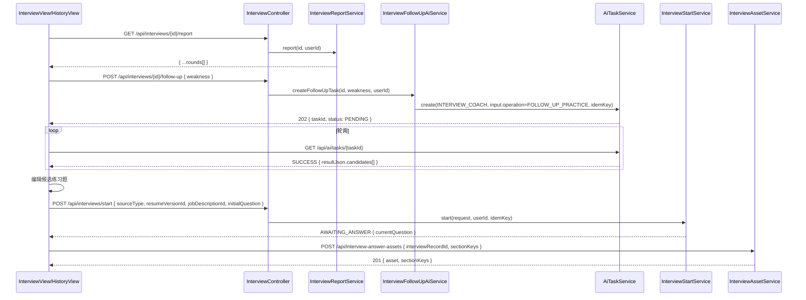
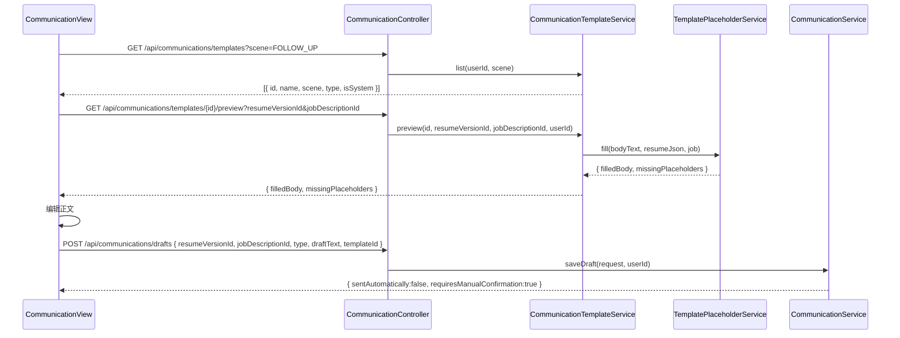
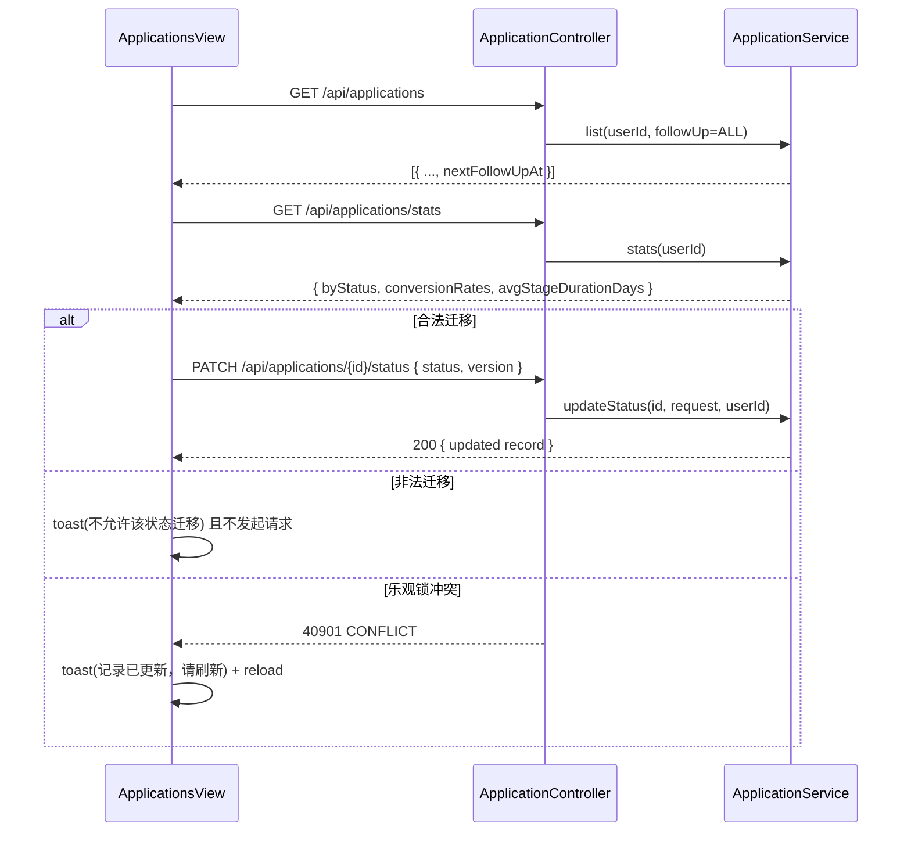
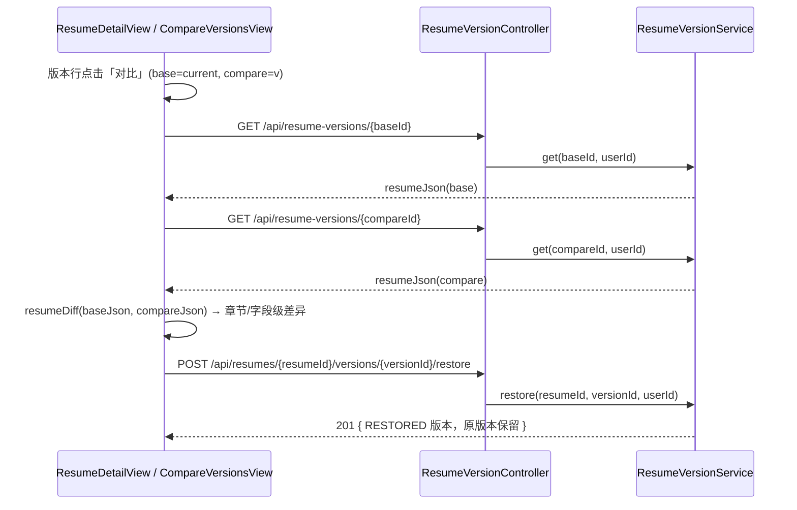

# 2026-08-31-004 设计：求职闭环 4 功能增强（系统设计与任务分解）

> date: 2026-08-31
> type: design（架构 + 任务分解）
> scope: 对应 `2026-08-31-004-prd.md`；基于 `PROJECT_CONTEXT.md` 与现有代码事实基线
> author: 架构师高见远
> status: ready-for-implementation
> 主理人裁决：D1~D6 全部落实，见下文各功能「裁决落实」。

---

## 0. 代码现状核对结论（非臆测）

已核对的关键事实：

- Flyway 最新版本为 **V22**，本增量新迁移命名为 **V23__career_loop_enhancements.sql**。
- 面试报告 `InterviewReportResponse` 目前**不含逐轮明细**；`interview_record` 已含 `round_no/question_text/answer_text/round_score/feedback_json/evaluation_source`，逐轮明细可直接由既有数据组装，**无需新增 AI 调用**。
- `interview_session` 的 `job_description_id` 在 V19 起可空；会话不记录 `source_type` 之外的操作元数据。
- 面试 AI（INTERVIEW_COACH）走**同步 provider 调用 + interview_ai_attempt**，不走 `ai_task`；而 PRD 要求 follow-up 走**异步任务**，因此 follow-up 需新建 `ai_task`（taskType 复用 `INTERVIEW_COACH` + input 判别，见 F1 方案）。
- `AiTaskService.create` 的同意校验按 `taskType.name()` 匹配 consent scope；`AI_CONSENT_TASK_SCOPES` 已含 `INTERVIEW_COACH`，**复用该 scope 可避免强制用户重新授权**。
- 答案资产 `InterviewAnswerAsset` 无章节关联；`GET /api/interview-answer-assets` 已支持 jobId/keyword 筛选。
- `application_record` 无 `next_follow_up_at`；看板 PATCH 状态走乐观锁 `version`，非法迁移抛 `40901 CONFLICT`。
- 前端无全局 toast 组件、无拖拽库；简历 14 章节键统一在 `web/src/resume/sectionRegistry.ts`（SECTION_KEYS）。
- 沟通模板当前为 `CommunicationService.generate` 服务端硬编码，`communication_draft` 已持久化，**绝不自动发送**的约束已存在。

---

## Part A：系统设计

## 1. 实现方案概览

技术栈沿用 **Spring Boot 3 / Java 17 + MySQL + Flyway** 与 **Vue3 + TS + Vite + Pinia**；**不引入任何新第三方依赖**（拖拽用原生 HTML5 DnD，diff 纯前端计算，toast 用轻量 composable）。

### F1 面试模拟增强（P0/P1/P2）

| 裁决 | 落实方式 |
|---|---|
| D1 历史会话独立列表页 | 新增 `GET /api/interviews`（只列 COMPLETED，支持 jobDescriptionId 筛选），新增 `InterviewHistoryView.vue` 只读回看，复用扩展后的报告接口 |
| D2 练习题以 AI 生成候选为主 | 新增 `POST /api/interviews/{id}/follow-up` → `202 + taskId`，复用 `GET /api/ai/tasks/{id}` 轮询；AI 输入只取自该次会话的简历/JD 真实事实；「从资产库匹配推荐」**不做**（P2 backlog） |

- **报告逐轮明细（F1-P0-01）**：扩展 `InterviewReportResponse` 增加 `rounds`（向后兼容，新增字段）；`InterviewReportService` 从 `interview_record` 组装，不新增 AI 调用。
- **一键沉淀资产（F1-P0-02）**：复用 `POST /api/interview-answer-assets`；服务端按 `(userId, interviewRecordId)` 幂等去重（已存在则返回已有资产），`GET` 列表新增可选 `interviewRecordId` 参数便于前端预标记已保存态。
- **薄弱项练习（F1-P1-03）**：
  - 新建 `ai_task`（`taskType=INTERVIEW_COACH`，`input.operation=FOLLOW_UP_PRACTICE`），由新增 `InterviewFollowUpAiService` 在 worker 中执行：从原会话加载同源简历/JD（复用 `InterviewPromptContextAssembler` + `InterviewContextSanitizer` 脱敏），结合指定 weakness 生成 3~5 条候选练习题，结果写入 `resultJson.candidates`。
  - 复用 `INTERVIEW_COACH` consent scope（数据类别 RESUME/INTERVIEW_ANSWER/JD），**不新增授权 scope**，避免存量用户重新授权；领域层在创建任务前按 `hasInterviewConsent` 同款类别校验。
  - 「确认后进入练习」：`StartInterviewRequest` 新增可选 `initialQuestion`（向后兼容）；提供时跳过 AI 首题生成，会话直接进入 `AWAITING_ANSWER`，后续回答评估沿用现有 AI/RULE 流程。练习会话复用原会话的 `resumeVersionId`/`jobDescriptionId`/`sourceType`，保证事实同源。
- **资产↔章节/素材联动（F1-P1-04）**：新表 `interview_asset_section(asset_id, section_key, material_id?)`；资产表单支持章节多选 + 素材（career_material）可选关联；列表响应返回 `sectionKeys/materialIds`，列表支持按 `sectionKey` 筛选；简历详情页新增「相关面试资产」只读面板（按章节），编辑器章节卡片增加极简只读关联列表。
- **历史列表（F1-P2-05）**：`GET /api/interviews` 返回会话摘要 + 实际题数 + 平均分（服务端一次查询聚合），前端历史页提供时间/JD 筛选 + 只读报告。

### F2 沟通草稿模板库（P0/P1）

| 裁决 | 落实方式 |
|---|---|
| D3 模板场景独立枚举 | 新增 `TemplateScene { FOLLOW_UP, THANK_YOU, SALARY, DECLINE, GENERAL }`，与 `CommunicationType { COVER_LETTER, EMAIL, OPENING_MESSAGE }` 载体类型解耦；`communication_template` 同时持有 `scene` + `template_type`；内置模板由 **Flyway V23 种子数据**写入（`is_system=1, user_id=NULL`，只读）；自定义模板 `user_id` 归属用户 |

- **模板库（F2-P0-01）**：`GET /api/communications/templates?scene=&type=` 返回内置 + 本人自定义（按 usage_count 降序，P2 顺带实现）。
- **预览与确认（F2-P0-02）**：`GET /api/communications/templates/{id}/preview?resumeVersionId=&jobDescriptionId=` 由服务端用真实简历版本 + JD 填充占位符，返回 `filledBody + missingPlaceholders`（解析不到的占位符原样保留并列出，前端高亮可手补）；「确认保存草稿（不发送）」走新端点 `POST /api/communications/drafts` 持久化 `communication_draft`，**绝不触发发送**。
- **事实约束（F2-P1-03）**：占位符白名单 `candidateName/jobTitle/companyName/topSkill/location/email/phone`；保存模板时服务端校验非法占位符 → `40001`；联系方式（email/phone）由服务端从简历 basics 合并填充，模板填充为纯字符串替换，**不经过任何模型**，天然满足「不发送给模型」。
- **自定义模板管理（F2-P1-04）**：`POST/PUT/DELETE /api/communications/templates[/{id}]`；自定义仅本人可见可改可删；内置模板修改/删除返回 `40301`。
- 架构说明：**不重载 `POST /api/communications/generate`**（PRD 衔接点提出可扩展 templateId，但会引入「预览不落库/确认落库」双模式歧义），改为「preview（不落库）+ drafts（落库）」两个职责单一的新端点，语义更清晰且完全向后兼容。

### F3 投递看板与统计（P0/P1）

| 裁决 | 落实方式 |
|---|---|
| D4 漏斗统计服务端接口 | 新增 `GET /api/applications/stats`（P0），前端不自行计算全量漏斗 |
| D5 拖拽本期必做 | 原生 HTML5 DnD 跨列拖拽；合法迁移复用 `PATCH /api/applications/{id}/status` + 乐观锁 `version`；非法迁移 **toast 阻止**（不移列、不落库，无回弹动画） |

- `application_record` 新增 `next_follow_up_at`（可空）；新建/编辑 composer 可设置；卡片展示（逾期红色高亮）；工具栏新增 全部/今日/逾期 筛选（服务端 `GET /api/applications?followUp=`，P0 落实 PRD 衔接点）；终态（OFFERED/REJECTED/WITHDRAWN）不展示跟进提醒（前端不渲染）。
- 漏斗统计：`byStatus` 数量+占比、`conversionRates`（APPLIED→INTERVIEWING、INTERVIEWING→OFFERED、APPLIED→OFFERED）、`avgStageDurationDays`（基于 appliedAt/updatedAt/createdAt 的近似算法，公式见共享约定）。
- 拖拽：目标列与 `allowedStatuses` 一致 → 调 PATCH；乐观锁冲突（40901）→ toast「记录已更新，请刷新」+ 重新拉列表；非法迁移 → toast「不允许该状态迁移」且不产生任何请求。

### F4 简历版本对比（P0/P1）

| 裁决 | 落实方式 |
|---|---|
| D6 diff 纯前端计算 | 不新增服务端 diff 接口；复用 `GET /api/resume-versions/{versionId}` 拉取两侧 `resumeJson`，前端 `web/src/utils/resumeDiff.ts` 计算 |

- 新增路由 `/resumes/:id/compare`（`CompareVersionsView.vue`）：base/compare 版本选择器（来自 `GET /api/resumes/{id}/versions`）→ 按 `SECTION_KEYS` 14 章节分组 → 章节级标识（新增/删除/有变化/无变化）→ 展开后条目并排，按稳定 key 对齐，字段级新增（绿）/删除（红）/修改（黄）高亮。
- 操作：恢复左侧/右侧版本（复用 `POST /api/resumes/{id}/versions/{versionId}/restore`，创建 RESTORED 新版本，原版本保留）；单侧复制章节（navigator.clipboard）；P2 差异摘要（有变化章节数、增删改条目数、只看有变化章节）顺带实现。
- 入口：`ResumeDetailView.vue` 版本行新增「对比」按钮，默认 base=当前版本、compare=该版本，可再切换。

### 架构模式

- 后端沿用现有分层：`Controller → Service → Repository`，`common.ApiResponse` 统一响应，`BusinessException + ErrorCode` 统一错误，`request.getAttribute("currentUserId")` 取当前用户并做归属校验。
- 异步 AI 沿用「领域端点创建 `ai_task`（202 + taskId）+ `GET /api/ai/tasks/{id}` 轮询 + retry/consent/quota」既有契约；worker 在 `TaskExecutionService` 增加 follow-up 分支。
- 前端沿用「视图本地状态 + `web/src/api/*` 契约 + `useTaskPolling` 轮询 + i18n」既有模式；**不新增 Pinia store**（现有跨页状态已够用，新增均为页面内状态；拖拽/toast 用 composable 隔离）。

---

## 2. 文件清单（新建 ✚ / 修改 ✎）

### 后端 `server/src/main/java/com/intelligentresume/`

**F1 interview**
- ✎ `interview/dto/InterviewReportResponse.java`（+`rounds`，含嵌套 `RoundDetail`）
- ✎ `interview/dto/InterviewStateResponse.java`（+`sourceType/resumeVersionId/jobDescriptionId`，供练习复用）
- ✎ `interview/dto/StartInterviewRequest.java`（+可选 `initialQuestion`）
- ✚ `interview/dto/InterviewSessionSummaryResponse.java`
- ✚ `interview/dto/FollowUpPracticeRequest.java`（`weakness`）
- ✎ `interview/controller/InterviewController.java`（+`GET /api/interviews`、+`POST /api/interviews/{id}/follow-up`）
- ✎ `interview/service/InterviewService.java`（门面委托）
- ✎ `interview/service/InterviewReportService.java`（组装 rounds）
- ✚ `interview/service/InterviewHistoryService.java`
- ✚ `interview/service/InterviewFollowUpAiService.java`（prompt/校验/执行）
- ✎ `interview/service/InterviewStartService.java`（initialQuestion 分支）
- ✎ `interview/service/InterviewStateAssembler.java`（新字段 + RoundDetail 组装）
- ✎ `interview/repository/InterviewSessionRepository.java`（历史列表查询）
- ✎ `interview/asset/dto/InterviewAssetRequest.java`（+`sectionKeys/materialIds`）
- ✎ `interview/asset/dto/InterviewAssetResponse.java`（+`sectionKeys/materialIds`）
- ✎ `interview/asset/controller/InterviewAssetController.java`（+`sectionKey`/`interviewRecordId` 筛选）
- ✎ `interview/asset/service/InterviewAssetService.java`（幂等 create + 关联管理）
- ✎ `interview/asset/repository/InterviewAnswerAssetRepository.java`（筛选 + 幂等查询）
- ✚ `interview/asset/domain/InterviewAssetSection.java`
- ✚ `interview/asset/repository/InterviewAssetSectionRepository.java`

**F2 communication**
- ✚ `communication/domain/TemplateScene.java`
- ✚ `communication/domain/CommunicationTemplate.java`
- ✚ `communication/repository/CommunicationTemplateRepository.java`
- ✚ `communication/dto/TemplateSummaryResponse.java`
- ✚ `communication/dto/TemplatePreviewResponse.java`
- ✚ `communication/dto/SaveTemplateRequest.java` / `UpdateTemplateRequest.java`
- ✚ `communication/dto/SaveDraftRequest.java`
- ✚ `communication/service/CommunicationTemplateService.java`
- ✚ `communication/service/TemplatePlaceholderService.java`
- ✎ `communication/controller/CommunicationController.java`（+templates/preview/drafts 端点）
- ✎ `communication/service/CommunicationService.java`（+saveDraft）

**F3 application**
- ✎ `application/domain/ApplicationRecord.java`（+`nextFollowUpAt`）
- ✎ `application/dto/ApplicationResponse.java`（+`nextFollowUpAt`）
- ✎ `application/dto/CreateApplicationRequest.java` / `UpdateApplicationRequest.java`（+`nextFollowUpAt`）
- ✚ `application/dto/ApplicationStatsResponse.java`
- ✎ `application/controller/ApplicationController.java`（+`followUp` 筛选、+`GET /stats`）
- ✎ `application/service/ApplicationService.java`（筛选 + stats）
- ✎ `application/repository/ApplicationRecordRepository.java`（筛选查询）

**AI worker**
- ✎ `ai/worker/TaskExecutionService.java`（+INTERVIEW_COACH + operation=FOLLOW_UP_PRACTICE 分支）

**数据库**
- ✚ `server/src/main/resources/db/migration/V23__career_loop_enhancements.sql`

### 前端 `web/src/`

- ✎ `api/interview.ts`（+rounds 类型、+listHistory、+createFollowUp、+initialQuestion）
- ✎ `api/interviewAsset.ts`（+sectionKeys/materialIds/sectionKey/interviewRecordId）
- ✎ `api/communication.ts`（+TemplateScene/模板列表/预览/保存草稿/模板 CRUD）
- ✎ `api/application.ts`（+nextFollowUpAt/stats/followUp）
- ✎ `api/ai.ts`（AiTask.taskType union + `INTERVIEW_COACH`）
- ✎ `views/InterviewView.vue`（报告 rounds 折叠、weakness 练习、报告内存资产、练习入口）
- ✎ `views/InterviewAssetsView.vue`（章节多选/标签/章节筛选）
- ✚ `views/InterviewHistoryView.vue`
- ✎ `views/CommunicationView.vue`（模板库双入口 + 预览确认 + 存为模板）
- ✎ `views/ApplicationsView.vue`（漏斗统计、跟进行/筛选、composer 日期、拖拽 + toast）
- ✎ `views/ResumeDetailView.vue`（版本行「对比」入口 + 相关面试资产面板）
- ✎ `views/ResumeEditorView.vue`（章节相关面试资产只读列表，极简）
- ✚ `views/CompareVersionsView.vue`
- ✚ `utils/resumeDiff.ts`
- ✚ `composables/useToast.ts`
- ✎ `router/index.ts`（+`interview-history`、+`resume-compare`）
- ✎ `i18n/index.ts`（zh-CN/en-US 全量新键）
- ✎ `layouts/AppLayout.vue`（面试历史导航入口，如有需要）

---

## 3. 数据模型变更（DDL）

### V23__career_loop_enhancements.sql（完整 DDL）

```sql
-- V23: 求职闭环 4 功能增强（F1/F2/F3）
-- 兼容 MySQL 5.7 / H2 MySQL mode（单条 ALTER 只改一列）

-- 1) F3: application_record 新增 next_follow_up_at（可空）
ALTER TABLE application_record ADD COLUMN next_follow_up_at DATETIME(3) NULL;

-- 2) F2: communication_template 沟通模板表
CREATE TABLE communication_template (
    id BIGINT PRIMARY KEY AUTO_INCREMENT,
    user_id BIGINT NULL COMMENT 'NULL = 内置系统模板；非空 = 用户自定义模板',
    scene VARCHAR(32) NOT NULL COMMENT 'FOLLOW_UP | THANK_YOU | SALARY | DECLINE | GENERAL',
    template_type VARCHAR(32) NOT NULL COMMENT 'COVER_LETTER | EMAIL | OPENING_MESSAGE',
    output_language VARCHAR(16) NOT NULL DEFAULT 'ZH_CN',
    name VARCHAR(128) NOT NULL,
    description VARCHAR(512) NULL,
    body_text TEXT NOT NULL COMMENT '含 {{占位符}}，白名单见共享约定',
    is_system TINYINT(1) NOT NULL DEFAULT 0,
    usage_count INT NOT NULL DEFAULT 0,
    created_at DATETIME(3) NOT NULL DEFAULT CURRENT_TIMESTAMP(3),
    updated_at DATETIME(3) NOT NULL DEFAULT CURRENT_TIMESTAMP(3),
    INDEX idx_comm_tpl_scene_lang (scene, output_language, is_system),
    INDEX idx_comm_tpl_user (user_id),
    CONSTRAINT fk_comm_tpl_user FOREIGN KEY (user_id) REFERENCES user(id)
) ENGINE=InnoDB DEFAULT CHARSET=utf8mb4 COLLATE=utf8mb4_unicode_ci;

-- 3) F1: interview_asset_section 资产↔简历章节/素材关联
CREATE TABLE interview_asset_section (
    id BIGINT PRIMARY KEY AUTO_INCREMENT,
    user_id BIGINT NOT NULL,
    asset_id BIGINT NOT NULL,
    section_key VARCHAR(32) NOT NULL COMMENT 'SECTION_KEYS 之一：basics/objective/links/work/volunteering/skills/projects/education/courses/certificates/publications/awards/languages/customSections',
    material_id BIGINT NULL COMMENT '可选：关联 career_material 条目',
    created_at DATETIME(3) NOT NULL DEFAULT CURRENT_TIMESTAMP(3),
    updated_at DATETIME(3) NOT NULL DEFAULT CURRENT_TIMESTAMP(3),
    UNIQUE KEY uq_asset_section_material (asset_id, section_key, material_id),
    INDEX idx_asset_section_user_key (user_id, section_key),
    CONSTRAINT fk_asset_section_user FOREIGN KEY (user_id) REFERENCES user(id),
    CONSTRAINT fk_asset_section_asset FOREIGN KEY (asset_id) REFERENCES interview_answer_asset(id),
    CONSTRAINT fk_asset_section_material FOREIGN KEY (material_id) REFERENCES career_material(id)
) ENGINE=InnoDB DEFAULT CHARSET=utf8mb4 COLLATE=utf8mb4_unicode_ci;

-- 4) F2: 内置模板种子数据（只读，user_id=NULL, is_system=1）
-- 目录（场景×载体×语言 = 14 行）：
--   FOLLOW_UP: EMAIL(zh/en) 跟进退件；OPENING_MESSAGE(zh/en) 跟进私信
--   THANK_YOU: EMAIL(zh/en) 感谢信
--   SALARY:    EMAIL(zh/en) 薪资沟通；OPENING_MESSAGE(zh/en) 薪资咨询
--   DECLINE:   EMAIL(zh/en) 婉拒 offer
--   GENERAL:   COVER_LETTER(zh/en) 通用求职信；OPENING_MESSAGE(zh/en) 通用打招呼
-- 占位符仅使用白名单：{{candidateName}} {{jobTitle}} {{companyName}} {{topSkill}} {{location}} {{email}} {{phone}}
INSERT INTO communication_template
    (user_id, scene, template_type, output_language, name, description, body_text, is_system)
VALUES
(NULL, 'FOLLOW_UP', 'EMAIL', 'ZH_CN', '跟进邮件-温和提醒',
 '投递 3-5 个工作日未回复时的温和跟进',
 '主题：关于 {{jobTitle}} 岗位的跟进\n\n您好，{{companyName}} 招聘团队：\n\n我是 {{candidateName}}，{{topSkill}} 相关背景。此前就 {{jobTitle}} 岗位提交了申请，想确认材料是否收到，也希望补充说明我的匹配点。\n\n如需更多信息，欢迎随时联系（{{email}} / {{phone}}）。\n\n祝好，\n{{candidateName}}', 1),
(NULL, 'THANK_YOU', 'EMAIL', 'ZH_CN', '面试感谢信',
 '面试后 24 小时内发送的感谢信',
 '主题：感谢 {{jobTitle}} 岗位面试\n\n您好，{{companyName}} 的 {{jobTitle}} 面试官：\n\n感谢您今天抽出时间面试。我对 {{jobTitle}} 岗位与团队方向很感兴趣，也进一步确认了 {{topSkill}} 相关经验与岗位的匹配。\n\n如有补充材料需要，请联系我（{{email}} / {{phone}}）。\n\n此致\n{{candidateName}}', 1),
(NULL, 'SALARY', 'EMAIL', 'ZH_CN', '薪资沟通-礼貌询问',
 '收到 offer 后礼貌询问薪资范围',
 '主题：关于 {{jobTitle}} 岗位的薪资沟通\n\n您好，{{companyName}} 的招聘团队：\n\n感谢 offer 沟通。{{jobTitle}} 岗位的职责与我 {{topSkill}} 背景高度匹配，我很期待加入。\n\n想进一步了解该岗位的薪资与福利范围，以便我做出完整评估。我的联系方式：{{email}} / {{phone}}。\n\n期待您的回复。\n{{candidateName}}', 1),
(NULL, 'DECLINE', 'EMAIL', 'ZH_CN', '婉拒 offer-诚恳致谢',
 '决定不接受的婉拒邮件',
 '主题：关于 {{jobTitle}} 岗位的决定\n\n您好，{{companyName}} 招聘团队：\n\n非常感谢贵司给予 {{jobTitle}} 岗位的 offer 与沟通中的诚意。经过慎重考虑，我最终选择接受另一份更契合当前职业规划的机会，因此无法接受这份 offer。\n\n再次感谢面试团队的认可，祝贵司招聘顺利。\n\n此致\n{{candidateName}}', 1),
(NULL, 'GENERAL', 'COVER_LETTER', 'ZH_CN', '通用求职信',
 '面向 {{jobTitle}} 岗位的通用求职信',
 '您好，我是 {{candidateName}}，现居 {{location}}。我希望申请 {{companyName}} 的 {{jobTitle}} 岗位。我的 {{topSkill}} 相关经验与岗位要求高度匹配，简历中记录了可核实的经历与成果。\n\n联系方式：{{email}} / {{phone}}。期待进一步沟通。\n\n此致\n{{candidateName}}', 1),
(NULL, 'FOLLOW_UP', 'EMAIL', 'EN', 'Follow-up Email - Gentle Reminder',
 'A gentle reminder when there is no reply after 3-5 business days',
 'Subject: Follow-up on {{jobTitle}} position\n\nDear {{companyName}} recruiting team,\n\nI am {{candidateName}}, with a background in {{topSkill}}. I applied for the {{jobTitle}} position earlier and wanted to confirm you received my materials. I would also welcome the chance to elaborate on my fit.\n\nFeel free to reach me at {{email}} / {{phone}}.\n\nBest regards,\n{{candidateName}}', 1);
-- 其余 8 行（THANK_YOU/SALARY/DECLINE/GENERAL 各场景 EN 变体与 OPENING_MESSAGE 变体）按同一白名单/结构补齐
```

> 说明：以上给出目录与 6 行代表示例；工程师按「目录 14 行」补齐全部内置模板，**占位符只允许白名单**。内置模板 `user_id=NULL` 只读；自定义模板 `user_id=当前用户, is_system=0`。

---

## 4. 接口设计

统一约定：响应 `ApiResponse{code,message,data,traceId}`；成功 `code=0`；错误码沿用 `ErrorCode`（40001 参数 / 40101 未登录 / 40301 无权限 / 40302 AI 未授权 / 40401 不存在 / 40901 冲突或非法迁移 / 42901 配额 / 50001 内部）。所有资源操作做归属校验；异步 AI 接口返回 `202 + AiTaskStatusResponse`，前端轮询 `GET /api/ai/tasks/{id}` 至 SUCCESS/FAILED/CANCELLED，支持 `POST /api/ai/tasks/{id}/retry`，创建需 `Idempotency-Key`。

### 4.1 F1 接口

**扩展 `GET /api/interviews/{id}/report`**（向后兼容：新增 `rounds` 字段）

```json
{
  "code": 0, "message": "success", "traceId": "...",
  "data": {
    "totalScore": 72, "summary": "...", "strengths": [], "weaknesses": [],
    "resumeSuggestions": [], "expressionSuggestions": [],
    "dimensionScores": { "relevance": 18, "evidenceSpecificity": 15, "structureClarity": 16, "roleCompetency": 14, "authenticityReflection": 9 },
    "targetQuestionCount": 6, "actualQuestionCount": 5,
    "completionReason": "USER_FINISHED", "evaluationSource": "MIXED",
    "aiEvaluatedRounds": 4, "ruleEvaluatedRounds": 1,
    "rounds": [
      {
        "roundNo": 1, "questionText": "…", "answerText": "…", "roundScore": 15,
        "dimensionScores": { "relevance": 4, "evidenceSpecificity": 3, "structureClarity": 3, "roleCompetency": 3, "authenticityReflection": 2 },
        "strengths": ["…"], "improvements": ["…"], "suggestedAnswer": "…",
        "resumeSuggestions": [], "expressionSuggestions": [], "evaluationSource": "AI"
      }
    ]
  }
}
```

**新增 `GET /api/interviews`**（历史会话列表，仅 COMPLETED）
- Query：`jobDescriptionId?`、`page?=1`、`size?=50`
- 权限：归属校验（仅当前用户）
- 响应 data：`[{ id, jobDescriptionId, resumeVersionId, sourceType, interviewMode, executionMode, completionReason, targetQuestionCount, actualQuestionCount, totalScore, createdAt, updatedAt }]`（按 updatedAt 降序；actualQuestionCount/totalScore 服务端聚合）

**新增 `POST /api/interviews/{id}/follow-up`**
- Header：`Idempotency-Key`（必填，≤64）
- Body：`{ "weakness": "缺少量化成果支撑" }`（weakness 取自该次报告 weaknesses 中的一条）
- 权限：会话归属校验 + 面试 AI 同意（RESUME/INTERVIEW_ANSWER，含 JD 时加 JOB_DESCRIPTION）
- 成功：`202`，data 为 `AiTaskStatusResponse{ id, taskType:"INTERVIEW_COACH", status:"PENDING", ... }`
- `resultJson`（SUCCESS 后）：`{ "operation":"FOLLOW_UP_PRACTICE", "promptVersion":"interview-follow-up-v1", "weakness":"…", "candidates":[ { "question":"…", "focus":"…", "expectedSignals":["…"], "coverageTags":["…"] } ] }`
- 错误：`40302` 未授权 / `40401` 会话不存在 / `40901` 会话未完成或任务幂等冲突 / `42901` 配额

**扩展 `POST /api/interviews/start`**（向后兼容）
- Body 增加可选字段：`"initialQuestion": "编辑后的练习题"`（≤500）
- 提供时：跳过 AI 首题生成，会话直接 `AWAITING_ANSWER`，`currentQuestion=initialQuestion`；其余参数（sourceType/resumeVersionId/jobDescriptionId/mode/targetQuestionCount/outputLanguage）照常，练习会话沿用原会话真实来源。

**扩展 `POST /api/interview-answer-assets`**（幂等）
- Body 增加可选 `sectionKeys: string[]`、`materialIds: number[]`
- 幂等：`(userId, interviewRecordId)` 已存在资产时**返回已有资产**（不重复创建）
- 新增校验：`sectionKey` 必须在 14 章节键内；`materialId` 必须归属当前用户

**扩展 `GET /api/interview-answer-assets`**
- Query 增加可选 `sectionKey`（按章节筛选）、`interviewRecordId`（按会话记录筛选，用于预标记已保存态）
- 响应 data 每项增加 `sectionKeys: string[]`、`materialIds: number[]`

### 4.2 F2 接口

**新增 `GET /api/communications/templates`**
- Query：`scene?`（TemplateScene）、`type?`（CommunicationType）、`outputLanguage?`（默认 ZH_CN）
- 权限：内置模板所有人可见；自定义模板仅本人可见
- 响应 data：`[{ id, scene, type, outputLanguage, name, description, isSystem, usageCount }]`（内置在前，按 usageCount 降序）

**新增 `GET /api/communications/templates/{id}/preview`**
- Query：`resumeVersionId`（必填）、`jobDescriptionId`（必填）、`outputLanguage?`
- 权限：模板可见性 + 简历版本/JD 归属校验
- 响应 data：`{ id, name, scene, type, filledBody, missingPlaceholders: ["candidateName", …] }`
- 行为：服务端用真实简历版本 + JD 填充白名单占位符；缺失值占位符原样保留并列入 `missingPlaceholders`；**不落库、不发送**

**新增 `POST /api/communications/drafts`**（确认保存草稿，绝不发送）
- Body：`{ resumeVersionId, jobDescriptionId, type, draftText, templateId? }`
- 权限：简历版本/JD 归属校验；`templateId` 存在时校验可见性并 `usage_count+1`
- 响应 data：`CommunicationResponse{ type, draft, sentAutomatically:false, requiresManualConfirmation:true, generationSource:"TEMPLATE" }`
- 行为：仅持久化 `communication_draft`，无任何发送能力

**新增 `POST /api/communications/templates`**（自定义模板）
- Body：`{ name, scene, type, bodyText, description?, outputLanguage? }`
- 校验：占位符白名单（非法 → `40001`）；name 非空 ≤128
- 响应 data：`TemplateSummaryResponse`（201）

**新增 `PUT /api/communications/templates/{id}`** / **`DELETE /api/communications/templates/{id}`**
- 权限：仅本人自定义模板；内置模板 → `40301`；他人模板 → `40401`
- 校验同创建；DELETE 返回 `ApiResponse<Void>`

### 4.3 F3 接口

**扩展 `GET /api/applications`**
- Query 增加可选 `followUp=ALL|TODAY|OVERDUE`（默认 ALL；TODAY=次日凌晨前；OVERDUE=已过且非终态）
- 响应 data 每项增加 `nextFollowUpAt: "2026-09-01T09:00:00" | null`（其余字段不变）

**扩展 `POST /api/applications` / `PUT /api/applications/{id}`**
- Body 增加可选 `nextFollowUpAt`（ISO 本地时间，可空）；其余不变（含乐观锁 version）

**新增 `GET /api/applications/stats`**
- 权限：归属校验
- 响应 data：
```json
{
  "total": 10,
  "byStatus": [ { "status": "APPLIED", "count": 3, "percent": 30.0 }, … ],
  "conversionRates": { "appliedToInterviewing": 0.67, "interviewingToOffered": 0.5, "appliedToOffered": 0.33 },
  "avgStageDurationDays": { "applied": 3.2, "interviewing": 5.1, "totalToOffer": 12.4 }
}
```
- 分母为 0 时对应值为 `null`；公式见「共享约定」。

### 4.4 F4 接口

无新增服务端接口；复用 `GET /api/resume-versions/{versionId}`、`GET /api/resumes/{resumeId}/versions`、`POST /api/resumes/{resumeId}/versions/{versionId}/restore`。

---

## 5. 前端设计

### 5.1 页面/组件清单与路由

| 路由 | 视图 | 说明 |
|---|---|---|
| `/interviews` | `InterviewView.vue`（✎） | 报告区重构：概览 + 逐轮问答卡片（可折叠、按薄弱维度筛选）；weakness 区块「生成针对性练习」→ 候选列表（可编辑、标注 AI 候选）→ 确认后以 `initialQuestion` 进入练习会话；每轮「存入资产」「复制建议答案」；顶部新增「面试历史」入口 |
| `/interviews/history` | `InterviewHistoryView.vue`（✚） | 历史完成会话列表（时间/JD 筛选），点击查看只读报告（复用报告接口，含逐轮明细） |
| `/interview-assets` | `InterviewAssetsView.vue`（✎） | 表单增加「关联章节」多选（14 章节键）与可选素材；列表卡片显示章节标签；筛选下拉按章节； |
| `/communications` | `CommunicationView.vue`（✎） | 顶部「AI 生成 / 模板库」双入口（tab）；模板库：左侧场景分类、右侧模板卡片 →「预览并填充」→ 预览面板（正文可编辑、缺失占位符高亮）→「确认保存草稿（不发送）」「复制」「用于投递」；草稿区新增「存为模板」弹窗（命名/选场景）；自定义模板卡片可编辑/删除 |
| `/applications` | `ApplicationsView.vue`（✎） | 汇总区扩展为漏斗区块（stats 接口）；卡片新增「下次跟进」日期行（逾期红色高亮，终态不显示）；工具栏 全部/今日/逾期 筛选；composer 增加「下次跟进时间」日期选择；卡片拖拽跨列变更状态，非法迁移 toast 阻止 |
| `/resumes/:id` | `ResumeDetailView.vue`（✎） | 版本行新增「对比」按钮（默认 base=当前版本/compare=该版本）+「相关面试资产」面板（按章节展示资产，只读） |
| `/resumes/:id/edit` | `ResumeEditorView.vue`（✎） | 章节卡片内极简「相关面试资产」只读列表（按当前章节 fetch），不写回 |
| `/resumes/:id/compare` | `CompareVersionsView.vue`（✚） | base/compare 选择器、章节级变化标识、条目并排字段级高亮、恢复左/右版本、单侧复制、差异摘要 |

### 5.2 关键前端模块

- `web/src/utils/resumeDiff.ts`（✚）：纯函数 diff（输入两侧 `resumeJson`，输出按 14 章节组织的 `SectionDiff[]`）。稳定 key 对齐规则见「共享约定」。
- `web/src/composables/useToast.ts`（✚）：轻量 toast（`{ type: 'success'|'error'|'info', message }` 队列 + 3s 自动消失），无第三方依赖。
- 状态管理：**不新增 Pinia store**；沿用「视图本地 state + `web/src/api/*`」约定（与现有 InterviewView/ApplicationsView 一致）。跨页仅 sessionStorage 传递草稿（已有 `application-draft` 机制，不新增）。
- 轮询：复用 `useTaskPolling`（F1 follow-up 任务轮询）与 `getTask`/`retryTask`。
- i18n：所有新增文案进 `i18n/index.ts`（zh-CN/en-US 双语），键命名空间：`interview.*`、`assets.*`、`history.*`、`communication.*`、`applications.*`、`resumeCompare.*`、`toast.*`；禁止硬编码。

---

## Part B：任务分解

## 6. 所需依赖包

**无新增第三方依赖。** 拖拽使用原生 HTML5 Drag and Drop；diff 使用自研纯函数；toast 使用自研 composable；异步轮询复用现有 `useTaskPolling`/`getTask`。

---

## 7. 任务列表（T1..T5，按依赖排序）

### T1 数据模型与后端契约基座（基础设施）
- **Source Files**：`V23__career_loop_enhancements.sql`；`communication/domain/TemplateScene.java`、`communication/domain/CommunicationTemplate.java`、`communication/repository/CommunicationTemplateRepository.java`；`interview/asset/domain/InterviewAssetSection.java`、`interview/asset/repository/InterviewAssetSectionRepository.java`；`interview/dto/InterviewReportResponse.java`（+rounds）、`interview/dto/InterviewStateResponse.java`（+sourceType/resumeVersionId/jobDescriptionId）、`interview/dto/StartInterviewRequest.java`（+initialQuestion）、`interview/dto/InterviewSessionSummaryResponse.java`、`interview/dto/FollowUpPracticeRequest.java`；`application/domain/ApplicationRecord.java`、`application/dto/ApplicationResponse.java`、`application/dto/CreateApplicationRequest.java`、`application/dto/UpdateApplicationRequest.java`、`application/dto/ApplicationStatsResponse.java`；`interview/asset/dto/InterviewAssetRequest.java`、`interview/asset/dto/InterviewAssetResponse.java`
- **Dependencies**：无
- **Priority**：P0
- **验收要点**：`mvn test` 通过；V23 迁移在 MySQL 与 H2 测试库均能干净执行（含内置模板种子 14 行）；所有新增/修改 DTO/Entity 编译通过；`InterviewReportResponse` 新增 `rounds` 不影响旧字段（向后兼容）；`application_record.next_follow_up_at` 可空。

### T2 后端业务服务与接口
- **Source Files**：`interview/controller/InterviewController.java`、`interview/service/InterviewService.java`、`interview/service/InterviewReportService.java`、`interview/service/InterviewHistoryService.java`、`interview/service/InterviewFollowUpAiService.java`、`interview/service/InterviewStartService.java`、`interview/service/InterviewStateAssembler.java`、`interview/repository/InterviewSessionRepository.java`；`interview/asset/controller/InterviewAssetController.java`、`interview/asset/service/InterviewAssetService.java`、`interview/asset/repository/InterviewAnswerAssetRepository.java`；`communication/controller/CommunicationController.java`、`communication/service/CommunicationTemplateService.java`、`communication/service/TemplatePlaceholderService.java`、`communication/service/CommunicationService.java`、`communication/dto/SaveTemplateRequest.java`、`communication/dto/UpdateTemplateRequest.java`、`communication/dto/SaveDraftRequest.java`、`communication/dto/TemplateSummaryResponse.java`、`communication/dto/TemplatePreviewResponse.java`；`application/controller/ApplicationController.java`、`application/service/ApplicationService.java`、`application/repository/ApplicationRecordRepository.java`；`ai/worker/TaskExecutionService.java`
- **Dependencies**：T1
- **Priority**：P0
- **建议实现顺序**：F3（stats/筛选）→ F2（模板库/预览/草稿）→ F1（报告 rounds/历史/follow-up/资产关联）
- **验收要点**：
  - F3：`GET /api/applications/stats` 数字正确（公式见共享约定，分母 0 返回 null）；`GET /api/applications?followUp=TODAY|OVERDUE` 过滤正确；非法迁移仍 40901。
  - F2：模板列表仅含内置 + 本人自定义；preview 用真实简历/JD 填充、缺失占位符列出；`POST /api/communications/drafts` 落库且 `sentAutomatically=false`；非法占位符 → 40001；内置模板 PUT/DELETE → 40301，他人模板 → 40401。
  - F1：报告含 rounds 明细；`GET /api/interviews` 仅 COMPLETED 且归属正确；`POST /api/interviews/{id}/follow-up` 返回 202 + taskId，轮询至 SUCCESS 后 `resultJson.candidates` 为 3~5 条；follow-up 任务创建前同意/配额校验生效；`start` 传 `initialQuestion` 时跳过首题 AI 直接 AWAITING_ANSWER；资产 create 按 `interviewRecordId` 幂等返回已有；`sectionKey`/`materialId` 校验 + 归属校验。

### T3 前端 F1 + F4
- **Source Files**：`api/interview.ts`、`api/interviewAsset.ts`、`api/ai.ts`；`views/InterviewView.vue`、`views/InterviewAssetsView.vue`、`views/InterviewHistoryView.vue`（✚）、`views/CompareVersionsView.vue`（✚）、`views/ResumeDetailView.vue`、`views/ResumeEditorView.vue`；`utils/resumeDiff.ts`（✚）
- **Dependencies**：T2
- **Priority**：P0（F4-P0/F1-P0 必须；P1 随附）
- **验收要点**：
  - 报告区展示逐轮问答卡片（可折叠、按薄弱维度筛选）；weakness「生成针对性练习」→ 候选可编辑 → 确认后以 `initialQuestion` 启动练习会话；报告内「存入资产」幂等且显示已保存态。
  - 资产页章节多选/标签/章节筛选；简历详情「相关面试资产」面板与编辑器章节关联列表只读可用。
  - 历史页列表（时间/JD 筛选）→ 只读报告。
  - 对比视图：base/compare 选择、14 章节分组、章节级标识、条目稳定 key 对齐、字段级新增/删除/修改高亮；恢复左/右版本（RESTORED 新版本）；单侧复制；差异摘要。
  - 全部文案走 i18n（zh/en 双键存在）。

### T4 前端 F2 + F3
- **Source Files**：`api/communication.ts`、`api/application.ts`；`views/CommunicationView.vue`、`views/ApplicationsView.vue`；`composables/useToast.ts`（✚）
- **Dependencies**：T2
- **Priority**：P0（F3-P0/F2-P0 必须；拖拽 P1 本期必做）
- **验收要点**：
  - 模板库：场景浏览/筛选、预览填充真实资料、缺失占位符高亮、确认保存草稿（不发送）、复制、用于投递；存为模板/编辑/删除本人模板。
  - 漏斗区块渲染 stats 数据；卡片下次跟进行（逾期红色高亮、终态不显示）；今日/逾期筛选；composer 日期设置。
  - 拖拽：合法迁移走 PATCH + version（40901 冲突 → toast + 刷新）；非法迁移 → toast 阻止、不落库、无回弹动画。
  - 全部文案走 i18n（zh/en 双键存在）。

### T5 集成与收尾
- **Source Files**：`router/index.ts`（+`interview-history`、+`resume-compare`）、`i18n/index.ts`（全量新键 zh/en）、`layouts/AppLayout.vue`（面试历史导航入口，如需要）、修复集成中发现的小问题
- **Dependencies**：T3、T4
- **Priority**：P0
- **验收要点**：`npm run build` 与 `mvn test` 通过；新路由鉴权正常；无硬编码文案（扫描确认）；端到端冒烟：面试报告→练习→资产、模板库→草稿、看板→拖拽/统计、版本对比→恢复 4 条主链路可走通。

---

## 8. 共享约定（跨文件约束）

1. **响应/错误**：一律 `ApiResponse{code,message,data,traceId}`；成功 code=0；错误码用 `ErrorCode`（40001/40101/40301/40302/40401/40901/42901/50001）。所有资源接口必须校验 `request.getAttribute("currentUserId")` 归属。
2. **异步 AI**：创建接口 `202 + AiTaskStatusResponse`；前端轮询 `GET /api/ai/tasks/{id}` 至 SUCCESS/FAILED/CANCELLED；FAILED 可 `POST /api/ai/tasks/{id}/retry`；创建带 `Idempotency-Key`；撤销授权后任务不得继续执行（沿用 worker 逻辑）。
3. **TemplateScene 枚举值**：`FOLLOW_UP | THANK_YOU | SALARY | DECLINE | GENERAL`；与 `CommunicationType`（COVER_LETTER/EMAIL/OPENING_MESSAGE）解耦，模板实体同时持有两者。
4. **占位符白名单**：`{{candidateName}} {{jobTitle}} {{companyName}} {{topSkill}} {{location}} {{email}} {{phone}}`；模板保存/预览服务端校验，非法占位符 → 40001；联系方式（email/phone）由服务端从简历 basics 合并，**模板填充不经过任何模型**；缺失值占位符原样保留并列入 `missingPlaceholders`。
5. **F3 统计公式**（服务端实现）：
   - `byStatus`：各状态数量 + `count/total*100`（保留 1 位小数）。
   - 转化率（只统计当前状态处于或越过该阶段的记录，排除 REJECTED/WITHDRAWN 对分母的干扰）：
     - `appliedToInterviewing = count(INTERVIEWING|OFFERED) / count(APPLIED|INTERVIEWING|OFFERED)`
     - `interviewingToOffered = count(OFFERED) / count(INTERVIEWING|OFFERED)`
     - `appliedToOffered = count(OFFERED) / count(APPLIED|INTERVIEWING|OFFERED)`
   - 平均停留（近似）：`applied` 取当前 APPLIED 记录 `avg(now - appliedAt)`（无 appliedAt 用 createdAt）；`interviewing` 取当前 INTERVIEWING 记录 `avg(now - updatedAt)`；`totalToOffer` 取 OFFERED 记录 `avg(updatedAt - appliedAt)`。分母 0 → null。
6. **`next_follow_up_at` 时区**：与全项目一致，服务端存储 `LocalDateTime`（DATETIME(3)，服务器时区，无时区偏移）；前端用 `Intl.DateTimeFormat(locale)` 渲染；TODAY/OVERDUE 由服务端按服务器本地日界计算（今日= `[startOfDay, endOfDay)`；逾期= `< now` 且状态非 OFFERED/REJECTED/WITHDRAWN）。
7. **F4 diff 稳定 key 对齐**：数组条目按 `id`（若存在）→ 复合键 `标题/名称 + 时间/起止时间`（如 `title|company + startDate`、`name + level`、`title + institution`）→ 兜底按数组下标对齐；字段比较用 JSON 规范序列化字符串判等；章节级：`UNCHANGED / ADDED / REMOVED / CHANGED`；字段级：`ADDED(绿) / REMOVED(红) / MODIFIED(黄)`。
8. **14 章节键**：统一从 `web/src/resume/sectionRegistry.ts` 的 `SECTION_KEYS` 引入（前后端字面量保持一致：basics/objective/links/work/volunteering/skills/projects/education/courses/certificates/publications/awards/languages/customSections）。
9. **AI 只产候选/草稿**：follow-up 练习题、模板填充均为候选/草稿，用户确认后才写入（练习会话、communication_draft）；沟通草稿绝不自动发送。
10. **i18n**：新增文案全部进 `web/src/i18n/index.ts`（zh-CN/en-US），禁止硬编码。

---

## 9. 类图（Mermaid classDiagram）

```mermaid
classDiagram
    class InterviewController {
        +report(id, req) ApiResponse
        +listHistory(jobDescriptionId, page, size, req) ApiResponse
        +createFollowUp(id, request, idemKey, req) ResponseEntity
    }
    class InterviewReportService {
        +report(id, userId) InterviewReportResponse
    }
    class InterviewReportResponse {
        +Integer totalScore
        +List~String~ strengths
        +List~String~ weaknesses
        +List~RoundDetail~ rounds
    }
    class RoundDetail {
        +Integer roundNo
        +String questionText
        +String answerText
        +Integer roundScore
        +DimensionScores dimensionScores
        +List~String~ strengths
        +List~String~ improvements
        +String suggestedAnswer
        +EvaluationSource evaluationSource
    }
    class InterviewHistoryService {
        +list(userId, jobDescriptionId, page, size) List~InterviewSessionSummaryResponse~
    }
    class InterviewSessionSummaryResponse {
        +Long id
        +Long jobDescriptionId
        +Integer actualQuestionCount
        +Integer totalScore
    }
    class InterviewFollowUpAiService {
        +executeTask(AiTask task) Map
    }
    class InterviewStartService {
        +start(request, userId, idemKey) InterviewStateResponse
    }
    class StartInterviewRequest {
        +InterviewSourceType sourceType
        +Long resumeVersionId
        +Long jobDescriptionId
        +String initialQuestion
    }
    class InterviewAssetService {
        +create(request, userId) InterviewAssetResponse
        +list(userId, jobId, keyword, sectionKey, interviewRecordId) List~InterviewAssetResponse~
    }
    class InterviewAnswerAsset {
        +Long userId
        +Long interviewRecordId
        +String questionText
        +String originalAnswerText
    }
    class InterviewAssetSection {
        +Long assetId
        +String sectionKey
        +Long materialId
    }
    class CommunicationTemplateService {
        +list(userId, scene, type, language) List~TemplateSummaryResponse~
        +preview(id, resumeVersionId, jobDescriptionId, userId) TemplatePreviewResponse
        +saveCustom(request, userId) TemplateSummaryResponse
        +update(id, request, userId) TemplateSummaryResponse
        +delete(id, userId) void
    }
    class TemplatePlaceholderService {
        +validate(bodyText) List~String~
        +fill(bodyText, resumeJson, job) FillResult
    }
    class CommunicationTemplate {
        +Long userId
        +TemplateScene scene
        +CommunicationType templateType
        +String bodyText
        +boolean isSystem
        +int usageCount
    }
    class CommunicationController {
        +listTemplates(scene, type, req) ApiResponse
        +previewTemplate(id, resumeVersionId, jobDescriptionId, req) ApiResponse
        +saveDraft(request, req) ApiResponse
        +saveTemplate(request, req) ResponseEntity
    }
    class ApplicationService {
        +list(userId, followUp) List~ApplicationResponse~
        +stats(userId) ApplicationStatsResponse
        +updateStatus(id, request, userId) ApplicationResponse
    }
    class ApplicationRecord {
        +ApplicationStatus status
        +LocalDateTime appliedAt
        +LocalDateTime nextFollowUpAt
        +Long version
    }
    class ApplicationStatsResponse {
        +int total
        +List~StatusCount~ byStatus
        +ConversionRates conversionRates
        +StageDurations avgStageDurationDays
    }
    class TaskExecutionService {
        +execute(AiTask task, String owner)
    }

    InterviewController --> InterviewReportService
    InterviewController --> InterviewHistoryService
    InterviewController --> InterviewFollowUpAiService
    InterviewController --> InterviewStartService
    InterviewReportService ..> InterviewReportResponse : 组装 rounds
    InterviewReportResponse *-- RoundDetail
    InterviewFollowUpAiService --> TaskExecutionService : worker 分发
    InterviewAssetService --> InterviewAnswerAsset
    InterviewAssetService --> InterviewAssetSection
    CommunicationController --> CommunicationTemplateService
    CommunicationTemplateService --> TemplatePlaceholderService
    CommunicationTemplateService --> CommunicationTemplate
    ApplicationController --> ApplicationService
    ApplicationService --> ApplicationRecord
    ApplicationService ..> ApplicationStatsResponse
```



## 10. 时序图（Mermaid sequenceDiagram）

### 10.1 F1 报告 → 薄弱项练习 → 练习会话 → 存资产



### 10.2 F2 模板库 → 预览 → 确认保存草稿



### 10.3 F3 看板统计与拖拽变更状态



### 10.4 F4 版本对比与恢复



---

## 11. 待明确事项

尽量少，能自决的已自决：

1. **follow-up 任务复用 `INTERVIEW_COACH` AiTaskType（input.operation 判别）而非新增枚举**：自决。理由：`AiTaskService` 的同意校验按 `taskType.name()` 匹配 scope，新增枚举会要求存量用户重新授权；复用 INTERVIEW_COACH（本就属于面试教练范畴）零摩擦，且领域层仍按 RESUME/INTERVIEW_ANSWER/JD 类别校验。若后续产品要求独立 scope，再引入新枚举 + 授权升级。
2. **F2 不重载 `POST /api/communications/generate`，改用 preview + drafts 两个新端点**：自决。理由：避免同一端点「预览不落库 / 确认落库」双模式歧义；PRD 衔接点已声明接口由架构师细化。`generate` 完全保持原契约。
3. **历史会话列表仅服务端聚合 actualQuestionCount/totalScore（N+1 可接受）**：自决。求职者个人数据量级小，优先复用现有 repository 模式，不引入聚合投影复杂度。
4. **简历编辑器「相关面试资产」为极简只读列表，不做写回/跳转编辑**：自决。PRD 只要求「可查看到」，避免改动编辑器核心交互；写回/联动编辑留待后续迭代。
5. **F3 拖拽实现采用原生 HTML5 DnD（非库）**：自决。满足「不引入新依赖」，功能足够。
6. 唯一提请确认项：内置模板目录（14 行种子）是否即最终文案口径？本设计给出目录与 6 行示例，工程师按目录补齐；如需产品最终文案，请 PM 提供逐字稿，否则以设计为准。
